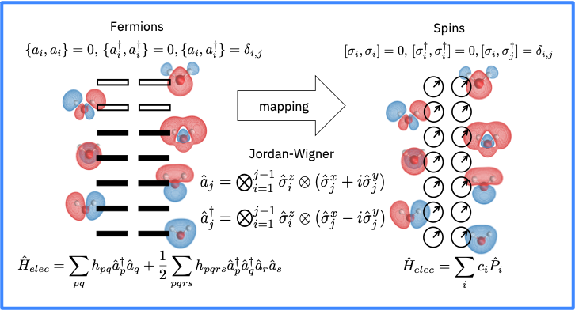

---
jupyter:
  jupytext:
    formats: ipynb,md
    text_representation:
      extension: .md
      format_name: markdown
      format_version: '1.3'
      jupytext_version: 1.14.5
  kernelspec:
    display_name: qiskit-env
    language: python
    name: qiskit-env
---

# 1. <a id='toc1_'></a>[QISKIT Lab 5 - Qubit Hamiltonian](#toc0_)

1. S. G. Nana Engo, serge.nana-engo@facsciences-uy1.cm
    * Department of Physics, Faculty of Science, University of Yaounde I
1. J-P. Tchapet Njafa, jean-pierre.tchapet-njafa@univ-maroua.cm
    * Department of Physics, Faculty of Science, University of Maroua
1. P. Djorwe, djorwepp@gmail.com
    * Department of Physics, Faculty of Science, University of Ngaoundere
       
June 2023


$
\newcommand{\HH}{\mathtt{H}}  
\newcommand{\ad}{a^\dagger}  
\newcommand{\kb}[2]{|#1\rangle\langle#2|} 
\newcommand{\proj}[1]{|#1\rangle\langle#1|}
\newcommand{\bk}[2]{\langle#1|#2\rangle}
\newcommand{\ket}[1]{|#1\rangle}
$


**Table of contents**<a id='toc0_'></a>    
- 1. [QISKIT Lab 5 - Qubit Hamiltonian](#toc1_)    
  - 1.1. [Correspondance (mapping) fermion qubit](#toc1_1_)    
    - 1.1.1. [Décomposition de Pauli](#toc1_1_1_)    
    - 1.1.2. [Opérateurs d'échelle qubit](#toc1_1_2_)    
  - 1.2. [Transformation de Jordan-Wigner (JWT)](#toc1_2_)    
    - 1.2.1. [Construction des Hamiltoniens dans la représentation de Jordan-Wigner](#toc1_2_1_)    
      - 1.2.1.1. [Operateurs 1-corps $\ad_p a_q $](#toc1_2_1_1_)    
      - 1.2.1.2. [Operateurs 2-corps $\ad_p\ad_q a_r a_s $](#toc1_2_1_2_)    
    - 1.2.2. [Utilisation de Qiskit Nature](#toc1_2_2_)    
  - 1.3. [Transformation de parité](#toc1_3_)    
  - 1.4. [Transformation de Bravyi-Kitaev (BKT)](#toc1_4_)    
  - 1.5. [Réductions de qubit plus avancées](#toc1_5_)    
    - 1.5.1. [Exercise](#toc1_5_1_)    
  - 1.6. [Résoudre le `ElectronicStructureProblem` de la molécule d'hydrogène](#toc1_6_)    
  - 1.7. [Hamiltonien quelconque](#toc1_7_)    
  - 1.8. [Cas de la molécule d'hydride de lithium](#toc1_8_)    
  - 1.9. [Cas de la molécule d'eau](#toc1_9_)    
    - 1.9.1. [Hamiltionien électronique](#toc1_9_1_)    
    - 1.9.2. [Active-Space reduction](#toc1_9_2_)    
    - 1.9.3. [`FreezeCoreTransformer`](#toc1_9_3_)    
    - 1.9.4. [ `ActiveSpaceTransformer`](#toc1_9_4_)    
- 2. [Questions](#toc2_)    

<!-- vscode-jupyter-toc-config
	numbering=true
	anchor=true
	flat=false
	minLevel=1
	maxLevel=6
	/vscode-jupyter-toc-config -->
<!-- THIS CELL WILL BE REPLACED ON TOC UPDATE. DO NOT WRITE YOUR TEXT IN THIS CELL -->

<!-- #region -->
## 1.1. <a id='toc1_1_'></a>[Correspondance (mapping) fermion qubit](#toc0_)

En simulation quantique, encoder un problème de structure électronique en seconde quantification sur un calculateur quantique revient à établir une correspondance entre les opérateurs d'échelle fermioniques et les opérateurs de Pauli. Les transformations de Jordan-Wigner (JWT), de Partité (PT) et de Bravyi-Kitaev (BKT) sont parmis les plus utilisés en calculs quantiques. Pour plus de détails, consulter J. T. Seeley, M. J. Richard, and P. J. Love,*The Bravyi-Kitaev transformation for quantum computation of electronic structure*, J. Chem. Phys **137**, 224109 (2012).

### 1.1.1. <a id='toc1_1_1_'></a>[Décomposition de Pauli](#toc0_)

Comme $\{\mathbb{I}, \mathtt{X}, \mathtt{Y}, \mathtt{Z}\}$ forme une base complète pour tout opérateur Hermitien 1- ou multi-qubit, l'ingrédient clé des algorithmes variationnels est de
décomposer l'Hamiltonien électronique en termes de produits des matrices de Pauli,
\begin{equation*}
\mathtt{P}_j=\mathtt{X}_{M-1}^j\otimes\mathtt{X}_{M-2}^j\otimes\mathtt{X}_k^j\otimes\dots\mathtt{X}_0^j,
\end{equation*}
où les opérateurs de Pauli $\mathtt{X}^j\in\{\mathbb{I},\mathtt{X},\mathtt{Y},\mathtt{Z}\}$ sont tels que
\begin{equation*}
\begin{aligned}
    &\mathtt{X}^i\mathtt{X}^j=\mathbb{I}\delta_{ij}+i\varepsilon_{ijk}\mathtt{X}^k, \\
    &\varepsilon_{ijk}=\begin{cases}+1, & \text{ pour les permutations circulaires droites de } (i,j,k) \\
    -1, & \text{ pour les permutations circulaires gauches de }(i,j,k) \\
    0, & \text{ sinon} \end{cases}
\end{aligned}
\end{equation*}

\begin{align*}
&\mathtt{X}:=\kb{0}{1}+\kb{1}{0}, &\mathtt{Y}&:=i(-\kb{0}{1}+\kb{1}{0}), &\mathtt{Z}:=\proj{0}-\proj{1}.
\end{align*}
Les opérateurs de Pauli sont à la fois unitaires et Hermitiens.

L'Hamiltonien total peut alors être représenté comme la combinaison linéaire de $\mathtt{P}_j$,
\begin{align*}
&\mathtt{H}=\sum_j^{N_k}w_j\mathtt{P}_j=\sum_j^{N_k}w_j\left(\bigotimes_i^{M-1}\mathtt{X}_i^j\right),
&w_j=\langle\mathtt{H},\mathtt{P}_j\rangle=\rm{Tr}(\mathtt{H}^\dagger\mathtt{P}_j),
\end{align*}
où $w_j$ sont les poids de la chaîne de Pauli $\mathtt{P}_j$, i indique sur quel qubit
l'opérateur agit, et j désigne le terme dans l'Hamiltonien.

Pour un Hamiltonien de la 2e quantification, le nombre total de chaînes de Pauli
$N_k$ dépend du nombre de termes $h_{pq}$ à 1-électron et $h_{pqrs}$ à
2-électrons.


### 1.1.2. <a id='toc1_1_2_'></a>[Opérateurs d'échelle qubit](#toc0_)

Ce sont les opérateurs suivants qui agissent localement sur les qubits :
$$
\begin{array}{l|l}
\textbf{Opérateur qubit}             &  \textbf{Description}\\\hline
\mathbb{I}=\begin{pmatrix}1 & 0 \\ 0 &1 \end{pmatrix} &\text{Identité}\\
\mathtt{Q}^-=\begin{pmatrix}0 & 1 \\ 1 & 0 \end{pmatrix}=\frac12(\mathtt{X} + i\mathtt{Y}) =\kb{1}{0} & \text{Annihilation} \\
\mathtt{Q}^+=\begin{pmatrix}0 & 0 \\ 1 & 0 \end{pmatrix}=\frac12(\mathtt{X} - i\mathtt{Y}) =\kb{0}{1} & \text{Création}\\
\mathtt{Q}^+\mathtt{Q}^-=\begin{pmatrix}0 & 0 \\ 0 &1 \end{pmatrix}=\frac12(\mathbb{I} - \mathtt{Z}) =\proj{1} & \text{Un nombre (particule)}\\
\mathtt{Q}^-\mathtt{Q}^+=\begin{pmatrix}0 & 0 \\ 0 &1 \end{pmatrix}=\frac12(\mathbb{I} + \mathtt{Z}) =\proj{0} & \text{Zéro nombre (trou)}\\\hline
\end{array}
$$
Les opérateurs qubits sont antisymétrique: $\{\mathtt{Q}^+,\mathtt{Q}^-\}=\mathtt{Q}^+\mathtt{Q}^- + \mathtt{Q}^-\mathtt{Q}^+ = \mathbb{I}$.
<!-- #endregion -->

<!-- #region -->
## 1.2. <a id='toc1_2_'></a>[Transformation de Jordan-Wigner (JWT)](#toc0_)

<center></center>

Elle stocke l'occupation de chaque spin-orbite dans chaque qubit, i.e.,
\begin{align*}
&\ket{f_{M-1},\dots,f_k,\dots, f_1,f_0} \rightarrow \ket{q_{M-1},
\dots,q_k,\dots, q_1, q_0}, 
&q_k :=\{\uparrow,\downarrow\}\equiv f_k \in \{0, 1 \}.
\end{align*}
et les opérateurs fermioniques de création et d'annihilation (respectivement
$\ad_k$ et $a_k$) sur des opérateurs de qubits non locaux de la forme
\begin{align*}
\begin{aligned}
&\ad_k \mapsto \frac12(\mathtt{X}_k - i\mathtt{Y}_k)\otimes \mathtt{Z}_{k-1} \otimes \dots \otimes \mathtt{Z}_0
\equiv \mathtt{Q}^+_k \bigotimes_{k=p-1}^0\mathtt{Z}_k,
&a_k \mapsto \frac12(\mathtt{X}_k + i \mathtt{Y}_k)\otimes\mathtt{Z}_{k-1}\otimes \dots \otimes \mathtt{Z}_0 
\equiv \mathtt{Q}_k^- \bigotimes_{k=p-1}^0\mathtt{Z}_k.
\end{aligned}
\end{align*}


Par exemple, puisque $\mathtt{Z}_k^2=\mathbb{I}_k$, on a
\begin{array}{l|l}
\textbf{Fermion}  & \textbf{Qubit}  \\\hline
a\ket{0001}+b\ket{0010}+c\ket{0100}+d\ket{1000} & a\ket{0001}+b\ket{0010}+c\ket{0100}+d\ket{1000} \\
a_0,\quad  a_1,\quad  a_2,\quad a_3 &\mathtt{Q}^-_0,\quad \mathtt{Q}^-_1\mathtt{Z}_0,\quad \mathtt{Q}^-_2\mathtt{Z}_1 \mathtt{Z}_0,\quad \mathtt{Q}^-_3\mathtt{Z}_2 \mathtt{Z}_1 \mathtt{Z}_0 \\
\ad_0,\quad \ad_1,\quad \ad_2,\quad \ad_3 & \mathtt{Q}^+_0,\quad \mathtt{Q}^+_1\mathtt{Z}_0,\quad \mathtt{Q}^+_2\mathtt{Z}_1 \mathtt{Z}_0,\quad \mathtt{Q}^+_3\mathtt{Z}_2 \mathtt{Z}_1 \mathtt{Z}_0 \\
n_k = \ad_k a_k &\mathtt{Q}^+_k \mathtt{Q}^-_k = \proj{1}_k=\frac12(\mathbb{I} - \mathtt{Z})_k \\\hline
\end{array}

<!-- #endregion -->

### 1.2.1. <a id='toc1_2_1_'></a>[Construction des Hamiltoniens dans la représentation de Jordan-Wigner](#toc0_)

Pour traduire l'Hamiltonien en une somme d'opérateurs de Pauli, il suffit de remplacer chacun des opérateurs $\ad$ et $a$ dans l'Hamiltonien fermionique par les chaînes d'opérateurs de Pauli correspondante. 

#### 1.2.1.1. <a id='toc1_2_1_1_'></a>[Operateurs 1-corps $\ad_p a_q $](#toc0_)

* Quand $p=q$, tous les opérateurs $\mathtt{Z}$ disparaissent compte tenu du fait que $\mathtt{Z}_p^2 = \mathbb{I}_p$, et on a 
  $$ \ad_p a_p \mapsto \mathtt{Q}^+_p \left(\bigotimes_{k=p-1}^0\mathtt{Z}_k\right)
  \mathtt{Q}^-_p \left(\bigotimes_{k=p-1}^0 \mathtt{Z}_k\right) = \frac12(\mathbb{I}_p-\mathtt{Z}_p).$$

* Pour tous les indices $p\neq q$, les opérateurs $\mathtt{Z}$ demeurent pour qubits entre $p$ et $q$, y compris p si $p < q$ et on a,
 
 \begin{align*} 
  \ad_p a_q \mapsto & \mathtt{Q}^+_p \left(\bigotimes_{k=p-1}^0\mathtt{Z}_k\right)
  \mathtt{Q}^-_q \left(\bigotimes_{k=q-1}^0 \mathtt{Z}_k\right)
  =\frac14(\mathtt{X}_p - i\mathtt{Y}_p)(\mathtt{X}_q + i\mathtt{Y}_q) \left(\bigotimes_{k=q-1}^p\mathtt{Z}_k\right)\\
  &=\frac14 (\mathtt{X}_p\mathtt{X}_q + i\mathtt{X}_p\mathtt{Y}_q
 - i\mathtt{Y}_p\mathtt{X}_q + \mathtt{Y}_p\mathtt{Y}_q ) \left(\bigotimes_{k=q-1}^p\mathtt{Z}_k\right)
\end{align*}

Par suite, dans les intégrales à 1-corps, on a les deux classes suivantes avec des orbitales à valeurs réelles, pour $p\leq q$ (ordre normal),

$$
\begin{array}{l|l|l}
\textbf{Opérateur} & \textbf{Seconde Quantification} &  \textbf{Représentation de Pauli} \\\hline
\text{Nombre} & \HH_{pp}=h_{pp}\ad_p a_p& \frac{h_{pp}}{2}(\mathbb{I}_p-\mathtt{Z}_p)\\
\text{Excitation}&\HH_{pq}=h_{pq}\ad_p a_q + h_{qp}  \ad_q a_p &\frac{h_{pq}}{2}(\mathtt{X}_q\mathtt{X}_p+\mathtt{Y}_q\mathtt{Y}_p)\left(\bigotimes_{k=q-1}^p\mathtt{Z}_k\right)\\\hline
\end{array}
$$


#### 1.2.1.2. <a id='toc1_2_1_2_'></a>[Operateurs 2-corps $\ad_p\ad_q a_r a_s $](#toc0_)

Pour un système fermionique, on a des éléments de matrice fermioniques pour $p<q$ et $r< s$. 

* Quand $p=s$ et $q=r$ tous les opérateurs $\mathtt{Z}$ disparaissent compte tenu du fait que $\mathtt{Z}_p^2 = \mathbb{I}_p$, et on a 
  
 \begin{align*} 
  \ad_p \ad_q a_q a_p \mapsto &\mathtt{Q}^+_p \left(\bigotimes_{k=p-1}^0\mathtt{Z}_k\right)
  \mathtt{Q}^+_q \left(\bigotimes_{k=q-1}^0\mathtt{Z}_k\right)
  \mathtt{Q}^-_q \left(\bigotimes_{k=q-1}^0 \mathtt{Z}_k\right)
  \mathtt{Q}^-_p \left(\bigotimes_{k=p-1}^0 \mathtt{Z}_k\right)\\
   &= \frac14(\mathbb{I}_p-\mathtt{Z}_p)(\mathbb{I}_q-\mathtt{Z}_q)
   = \frac14(\mathbb{I}_p\mathbb{I}_q -\mathbb{I}_p\mathtt{Z}_q -\mathtt{Z}_p\mathbb{I}_q +-\mathtt{Z}_p\mathtt{Z}_q)
 \end{align*} 

* Pour tous les indices $p<q$ et $p<s$, on a, 
 
 \begin{align*} 
  \ad_p \ad_q a_q a_s \mapsto & \mathtt{Q}^+_p \left(\bigotimes_{k=p-1}^0\mathtt{Z}_k\right)
  \frac12(\mathbb{I}_q-\mathtt{Z}_q) \mathtt{Q}^-_s \left(\bigotimes_{k=s-1}^0 \mathtt{Z}_k\right)
  =\frac14(\mathtt{X}_p - i\mathtt{Y}_p)(\mathtt{X}_s + i\mathtt{Y}_s)\frac12(\mathbb{I}_q-\mathtt{Z}_q) \left(\bigotimes_{k=p-1}^s\mathtt{Z}_k\right)\\
  &=\frac18 (\mathtt{X}_p\mathtt{X}_s + i\mathtt{X}_p\mathtt{Y}_s
 - i\mathtt{Y}_p\mathtt{X}_s + \mathtt{Y}_p\mathtt{Y}_s ) (\mathbb{I}_q-\mathtt{Z}_q)\left(\bigotimes_{k=p-1}^s\mathtt{Z}_k\right)
\end{align*}

Par suite, les trois classes des opérateurs à 2-corps, pour $p<q<r<s$ (ordre normal) et orbitales à valeurs réelles, sont

$$
\begin{array}{l|l|l}
\textbf{Opérateur} & \textbf{Seconde Quantification} &  \textbf{Représentation de Pauli} \\\hline
\text{Coulomb/Echange} &\HH_{pqqp}=h_{pqqp} \ad_p \ad_q a_q a_p& \frac{h_{pqqp}}{4}(\mathbb{I}-\mathtt{Z}_p-\mathtt{Z}_q+\mathtt{Z}_p \mathtt{Z}_q)\\
\text{Nombre Excitation} &\HH_{pqqs}=h_{pqqs}(\ad_p \ad_q a_q a_s + \ad_s \ad_q a_q a_p)&\frac{h_{pqqs}}{4}(\mathtt{X}_s\mathtt{X}_p+\mathtt{Y}_s\mathtt{Y}_p)(\mathbb{I}-\mathtt{Z}_q)\left( \bigotimes_{k=s-1}^p\mathtt{Z}_k\right)\\
\text{Double excitation}&\HH_{pqrs}=h_{pqrs}(\ad_p \ad_q a_r a_s+\ad_s \ad_r a_q a_p) &
\begin{split}
\frac{h_{pqrs}}{8}
\begin{pmatrix}\mathtt{X}_p\mathtt{X}_q\mathtt{X}_r \mathtt{X}_s-\mathtt{X}_p\mathtt{X}_q\mathtt{Y}_r\mathtt{Y}_s+\mathtt{X}_p\mathtt{Y}_q\mathtt{X}_r\mathtt{Y}_s\\+\mathtt{Y}_p\mathtt{X}_q\mathtt{X}_r\mathtt{Y}_s+\mathtt{Y}_p\mathtt{X}_q\mathtt{Y}_r\mathtt{X}_s-\mathtt{Y}_p\mathtt{Y}_q\mathtt{X}_r\mathtt{X}_s\\+\mathtt{X}_p\mathtt{Y}_q\mathtt{Y}_r\mathtt{X}_s+\mathtt{Y}_p\mathtt{Y}_q\mathtt{Y}_r\mathtt{Y}_s\end{pmatrix}\\
\left(\bigotimes_{j=q-1}^p\mathtt{Z}_j\right)\left(\bigotimes_{k=s-1}^r\mathtt{Z}_k\right)\\\hline
\end{split}
 \\\hline
\end{array}
$$


### 1.2.2. <a id='toc1_2_2_'></a>[Utilisation de Qiskit Nature](#toc0_)

```python
import numpy as np
```

```python
from qiskit_nature.units import DistanceUnit
from qiskit_nature.second_q.drivers import PySCFDriver

H2_driver = PySCFDriver(
    atom="H 0 0 0; H 0 0 0.735",
    basis="sto3g",
    charge=0,
    spin=0,
    unit=DistanceUnit.ANGSTROM,
)

H2_problem = H2_driver.run()
H2_hamiltonian = H2_problem.hamiltonian
H2_fermionic_op = H2_hamiltonian.second_q_op()
```

```python
from qiskit_nature.second_q.mappers import JordanWignerMapper
from qiskit_nature.second_q.operators import FermionicOp
```

Définissons une fonction `label_to_qubit()` pour convertir les opérateurs fermioniques en opérateurs qubits.

```python
def label_to_qubit(label, mapper):
    f_op = FermionicOp(label)
    qubit_op = mapper.map(f_op)
    return qubit_op
```

Convertissons les opérateurs fermioniques {"+_0":1.0}, {"+_1":1.0}, {"+_2":1.0}, {"+_3":1.0}, {"+_4":1.0} en opérateurs qubits avec la JWT:

```python
for k in ({"+_0":1.0}, {"+_1":1.0}, {"+_2":1.0}, {"+_3":1.0}, {"+_4":1.0}):
  qubit_op = label_to_qubit(k, JordanWignerMapper())
  print(f"{k}:\n {qubit_op}\n")
```

```python
H2_qubit_JW_op = JordanWignerMapper().map(H2_fermionic_op)

print("Number of items in the JWT Pauli list:", len(H2_qubit_JW_op))
print(H2_qubit_JW_op)
```

```python
H2_JW_particle_number_op = H2_problem.properties.particle_number.second_q_ops()["ParticleNumber"]
print(H2_JW_particle_number_op)
```

## 1.3. <a id='toc1_3_'></a>[Transformation de parité](#toc0_)

C'est la transformation dual de la JWT: les opérateurs de la parité sont légers alors que les opérateurs d'occupation sont lourds. Le calcul des parités peut être réalisé en utilisant uniquement des opérateurs $\mathtt{X}$ à 1-qubit et en utilisant la transformation de parité suivante,
\begin{align*}
&\ket{f_{M-1},\dots,f_k,\dots, f_1,f_0} \mapsto \ket{\mathbf{p}} , \qquad p_k = \sum_{j=k}^0 q_j \pmod 2 = q_k\oplus\dots\oplus q_0\\
& \ad_k \mapsto \mathtt{X}_{M-1} \otimes \dots \otimes \mathtt{X}_{k+1} \otimes
\frac12(\mathtt{X}_k\otimes \mathtt{Z}_{k-1} - i \mathtt{Y}_k)\equiv \mathtt{X}_{M-1} \otimes \dots \otimes \mathtt{X}_{k+1} \otimes \mathtt{P}_k^+,\\
& a_k \mapsto \mathtt{X}_{M-1} \otimes \dots \otimes \mathtt{X}_{k+1} \otimes
\frac12(\mathtt{X}_k\otimes \mathtt{Z}_{k-1} + i \mathtt{Y}_k)\equiv \mathtt{X}_{M-1} \otimes \dots \otimes \mathtt{X}_{k+1} \otimes \mathtt{P}_k^-,\\
&\mathtt{P}_k^\pm =Q^\pm_k \otimes \proj{0}_{k-1} - Q^\mp_k \otimes \proj{1}_{k-1} .
\end{align*}

Afin de définir les transformations entre les bases, nous considérerons en termes de correspondance entre chaînes de bits. Pour
toutes les transformations que nous considérons, qui ne font intervenir que des sommes de bits $\mod 2$, il est possible de représenter leur action par matrices agissant sur le vecteur de valeurs binaires correspondant à un état de base logique donné. La correspondance à la base de parité est donnée par :
$$ p_k = \sum_j [ \pi_n]_{kj}\ f_j,$$
où $n$ est le nombre d'orbitales. $\pi_n$ est la matrice $(n\times n)$ suivant
\begin{align*}
 & [\pi_n]_{kj} =  
  \begin{cases}
    1 & \quad k < j \\
    0 & \quad k \geq j\\
  \end{cases} ,
  &  \pi_n = 
 \begin{pmatrix}
  1 & 1 & \cdots & 1 \\
  0 & 1 & \cdots & 1 \\
  \vdots  & \vdots  & \ddots & \vdots  \\
  0 & 0 & \cdots & 1
 \end{pmatrix}
\end{align*}
Soulignons que nous indexons la matrice $\pi_n$ à partir du coin inférieur droit, par souci de cohérence avec notre schéma de numérotation orbitale. 

Par exemple, pour changer l'état de base du numéro d'occupation $|1 0 1 0 0 1 1 1\rangle$ en son état de base de parité correspondant $|1 0 0 1 1 1 0 1\rangle$, nous agissons avec la matrice $\pi_8$ sur la chaîne de bits appropriée :

$$
\begin{matrix}
& \begin{matrix}f_7 & f_6 & f_5 & f_4 & f_3 & f_2 & f_1 & f_0 \end{matrix} \\
\begin{matrix}p_7\\p_6\\p_5\\p_4\\p_3\\p_2\\p_1\\p_0\end{matrix}&
\begin{pmatrix} 1_{\phantom{7}} & 1_{\phantom{6}} & 1_{\phantom{5}} & 1_{\phantom{4}} & 1_{\phantom{3}} & 1_{\phantom{2}} & 1_{\phantom{1}} & 1_{\phantom{0}} \\
               0 & 1 & 1 & 1 & 1 & 1 & 1 & 1 \\
               0 & 0 & 1 & 1 & 1 & 1 & 1 & 1 \\
               0 & 0 & 0 & 1 & 1 & 1 & 1 & 1 \\
               0 & 0 & 0 & 0 & 1 & 1 & 1 & 1 \\
               0 & 0 & 0 & 0 & 0 & 1 & 1 & 1 \\
               0 & 0 & 0 & 0 & 0 & 0 & 1 & 1 \\
               0 & 0 & 0 & 0 & 0 & 0 & 0 & 1 
 \end{pmatrix}
\end{matrix}
\begin{pmatrix}
  1 \\
  0 \\
  1 \\
  0 \\
  0 \\
  1 \\
  1 \\
  1\\
 \end{pmatrix}
 =
 \begin{pmatrix}
  1 \\
  0 \\
  0 \\
  1 \\
  1 \\
  1 \\
  0 \\
  1\\
 \end{pmatrix}
$$

Le tableau suivant donne quelques exemples de la transformation de parité.
$$
\begin{array}{l|l}
\textbf{Fermion} & \textbf{Qubit} \\ \hline
a\ket{0001}+b\ket{0010}+c\ket{0100}+d\ket{1000} & a\ket{1111}+b\ket{1110}+c\ket{1100}+d\ket{1000}  \\
a_0 ,\quad a_1 ,\quad a_2 ,\quad a_3 &
\begin{split}
&\mathtt{X}_3\mathtt{X}_2\mathtt{X}_1Q^-_0 ,\quad \mathtt{X}_3\mathtt{X}_2\big( Q^-_1\proj{0}_0 - Q^+_1\proj{1}_0 \big) ,\\ &\mathtt{X}_3\big( Q^-_2\proj{0}_1 - Q^+_2\proj{1}_1 \big) ,\quad Q^-_3\proj{0}_2 - Q^+_3\proj{1}_2
\end{split} \\
\ad_0 ,\quad \ad_1 ,\quad \ad_2 ,\quad \ad_3 &
\begin{split}
& \mathtt{X}_3\mathtt{X}_2\mathtt{X}_1Q^+_0 ,\quad \mathtt{X}_3\mathtt{X}_2\big( Q^+_1\proj{0}_0 - Q^-_1\proj{1}_0 \big) ,\\ &\mathtt{X}_3\big( Q^+_2\proj{0}_1 - Q^-_2\proj{1}_1 \big) ,\quad Q^+_3\proj{0}_2 - Q^-_3\proj{1}_2 
\end{split}\\
n_k = \ad_k a_k & \proj{1}_{k=0}=\frac12(\mathbb{I} - \mathtt{Z}_0) ,\quad  \frac12(\mathbb{I} - \mathtt{Z}_k\mathtt{Z}_{k-1})_{k=1,2,3}\\\hline
\end{array}
$$


Convertissons les opérateurs fermioniques {"+_0":1.0}, {"+_1":1.0}, {"+_2":1.0}, {"+_3":1.0}, {"+_4":1.0} en opérateurs qubits avec la transformation de la parité :

```python
from qiskit_nature.second_q.mappers import ParityMapper

for k in ({"+_0":1.0}, {"+_1":1.0}, {"+_2":1.0}, {"+_3":1.0}, {"+_4":1.0}):
  qubit_op = label_to_qubit(k, ParityMapper())
  print("{}:\n {}\n".format(k, qubit_op))
```

```python
H2_qubit_P_op = ParityMapper().map(H2_fermionic_op)

print("Number of items in the PT Pauli list:", len(H2_qubit_P_op))
print(H2_qubit_P_op)
```

La transformation de la parité présente un avantage majeur pour les problèmes dans lesquels nous voulons préserver le nombre de particules de chaque espèce de spin, En effet, elle nous permet de supprimer 2 qubits, car l'information qu'ils contiennent devient redondante.

Comme Qiskit Nature dispose les qubits en ordre bloc, de telle sorte que la première moitié encode l'information sur le spin alpha et la seconde moitié l'information sur le spin bêta, cela signifie que l'on peut supprimer le N/2ème et le Nème qubit.

Pour ce faire, vous devez spécifier le nombre de particules dans votre système, comme suit :

```python
H2_qubit_P_op = ParityMapper(num_particles=H2_problem.num_particles).map(H2_fermionic_op)

print("Number of items in the PT Pauli list:", len(H2_qubit_P_op))
print(H2_qubit_P_op)
```

## 1.4. <a id='toc1_4_'></a>[Transformation de Bravyi-Kitaev (BKT)](#toc0_)

Cette transformation combine la localité des nombres d'occupation et celle des parités, afin d'établir une correspondance entre les opérateurs de création et de destruction fermioniques et les opérateurs qubits sur $\mathcal{O}(\log_2M)$. Pour ce faire, elle fait correspondre les états du nombre d'occupations à des chaînes binaires définies de manière appropriée,

\begin{align*}
    &\ket{f_{M-1},\dots,f_k,\dots, f_1,f_0}\mapsto \ket{\mathbf{b}} , &&b_k = \sum_{j=0}^k B_{kj} \, f_j \, \pmod 2,\\
    &B_1 = [1], &&B_{2^{x+1}}= \begin{pmatrix} B_{2^x} & \mathtt{A}\\ \mathbb{O} & B_{2^x}\end{pmatrix} ,
\end{align*}

où la matrice binaire $B$ $M \times M$ a la structure d'un arbre binaire, $\mathbf{A}$ est une matrice $(2^x \times 2^x)$ de 0, la rangée supérieure étant remplie de 1, et $\mathbb{O}$ est une matrice zéro $(2^x \times 2^x)$. À titre d'exemple, lorsque $M = 2,4$ ($x=0,1$), la matrice $B_{kj}$ est la suivante

\begin{align*}
    &\mathtt{B}_2 = \begin{pmatrix}1 & 1\\0 & 1 \end{pmatrix}
    &\mathtt{B}_4 = \left(\begin{array}{cc|cc}
    1 & 1 & 1 & 1 \\
    0 & 1 & 0 & 0 \\\hline
    0 & 0 & 1 & 1 \\
    0 & 0 & 0 & 1 
 \end{array}\right)
\end{align*}

Par exemple, pour changer l'état de base du numéro d'occupation $|1 0 1 0 0 1 1 1\rangle$ en son état de base de BK correspondant $|1 0 1 0 1 1 0 1\rangle$, nous agissons avec la matrice $\pi_8$ sur la chaîne de bits appropriée :

$$
\begin{matrix}
& \begin{matrix}f_7 & f_6 & f_5 & f_4 & f_3 & f_2 & f_1 & f_0 \end{matrix} \\
\begin{matrix}b_7\\b_6\\b_5\\b_4\\b_3\\b_2\\b_1\\b_0\end{matrix}&
\begin{pmatrix} 1_{\phantom{7}} & 1_{\phantom{6}} & 1_{\phantom{5}} & 1_{\phantom{4}} & 1_{\phantom{3}} & 1_{\phantom{2}} & 1_{\phantom{1}} & 1_{\phantom{0}} \\
               0 & 1 & 0 & 0 & 0 & 0 & 0 & 0 \\
               0 & 0 & 1 & 1 & 1 & 1 & 1 & 1 \\
               0 & 0 & 1 & 1 & 0 & 0 & 0 & 0  \\
               0 & 0 & 0 & 0 & 1 & 1 & 1 & 1 \\
               0 & 0 & 0 & 0 & 0 & 1 & 0 & 0 \\
               0 & 0 & 0 & 0 & 0 & 0 & 1 & 1  \\
               0 & 0 & 0 & 0 & 0 & 0 & 0 & 1 
 \end{pmatrix}
\end{matrix}
\begin{pmatrix}
  1 \\
  0 \\
  1 \\
  0 \\
  0 \\
  1 \\
  1 \\
  1\\
 \end{pmatrix}
 =
 \begin{pmatrix}
  1 \\
  0 \\
  1 \\
  0 \\
  1 \\
  1 \\
  0 \\
  1\\
 \end{pmatrix}
$$

 Puisqu'elle ne nécessite que $\mathcal{O}(\log_2 M)$ opérateurs qubits, \textbf{les transformations BK permettent un codage plus économique des opérateurs fermioniques en opérateurs qubits}, avec un coût réduit pour les  mesures et les circuits quantiques. Mais elle ne s'applique que sur des  systèmes de $N$ est pair, c'est-à-dire $N=2^m$.

Le tableau suivant donne quelques exemples de la transformation BK.

$$
\begin{array}{l|l}
\textbf{Fermion} & \textbf{Qubit} \\ \hline
a\ket{0001}+b\ket{0010}+c\ket{0100}+d\ket{1000} & a\ket{1011}+b\ket{1010}+c\ket{1100}+d\ket{1000}  \\
a_0 ,\quad a_1 ,\quad a_2 ,\quad a_3 &
\begin{aligned}
&\mathtt{X}_3\mathtt{X}_1Q^-_0 ,\quad \mathtt{X}_3\big( Q^-_1\proj{0}_0 - Q^+_1\proj{1}_0 \big) ,\\ &\mathtt{X}_3Q^-_2\mathtt{Z}_1 ,\quad 
\frac12\Big(Q^-_3(\mathbb{I} + \mathtt{Z_2Z_1}) -  Q^+_3(\mathbb{I} - \mathtt{Z_2Z_1})\Big)
\end{aligned} \\
\ad_0 ,\quad \ad_1 ,\quad \ad_2 ,\quad \ad_3 &
\begin{aligned}
&\mathtt{X}_3\mathtt{X}_1Q^+_0 ,\quad \mathtt{X}_3\big( Q^+_1\proj{0}_0 - Q^-_1\proj{1}_0 \big) ,\\ &\mathtt{X}_3Q^+_2\mathtt{Z}_1 ,\quad 
\frac12\Big(Q^+_3(\mathbb{I} + \mathtt{Z_2Z_1}) -  Q^-_3(\mathbb{I} - \mathtt{Z_2Z_1})\Big)
\end{aligned} \\
n_k = \ad_k a_k & \proj{1}_{k=0,2} ,\quad  \frac12(\mathbb{I} - \mathtt{Z}_1\mathtt{Z}_{0})_{k=1},
\quad  \frac12(\mathbb{I} - \mathtt{Z}_2\mathtt{Z}_1\mathtt{Z}_{0})_{k=3}
\\\hline
\end{array}
$$

```python
def BK(m):
  I = [[1, 0], [0, 1]]
  d = {}
  d[0] = [1]
  for k in range(0, m):
      B = np.kron(I,d[k])
      for l in range(2**k, 2**(k+1)):
          B[0,l] = 1
      d[k+1] = B
  return d
  
```

```python
from qiskit.visualization import array_to_latex

d = BK(3)
for k, v in d.items():
  s = "B_{"+str(2**k)+"} = "
  display(array_to_latex(v, prefix=s, precision = 0))
  print(" ")
```

Convertissons les opérateurs fermioniques {"+_0":1.0}, {"+_1":1.0}, {"+_2":1.0}, {"+_3":1.0}, {"+_4":1.0} en opérateurs qubits avec la BKT:

```python
from qiskit_nature.second_q.mappers import BravyiKitaevMapper

for k in ({"+_0":1.0}, {"+_1":1.0}, {"+_2":1.0}, {"+_3":1.0}, {"+_4":1.0}):
  qubit_op = label_to_qubit(k, BravyiKitaevMapper())
  print("{}:\n {}\n".format(k, qubit_op))
```

```python
H2_qubit_BK_op = BravyiKitaevMapper().map(H2_fermionic_op)

print("Number of items in the BKT Pauli list:", len(H2_qubit_BK_op))
print(H2_qubit_BK_op)
```

## 1.5. <a id='toc1_5_'></a>[Réductions de qubit plus avancées](#toc0_)

Il est possible d'effectuer des réductions de qubit plus avancées, qui sont basées sur la recherche de symétries $\mathbb{Z}2$ dans l'espace de Hilbert du qubit. **Une exigence pour que cela soit utile est que vous sachiez dans quel sous-espace de symétrie vous devez rechercher votre solution d'intérêt réelle**. Cela peut être un peu délicat, mais heureusement, les classes de problèmes de Qiskit Nature vous fournissent un utilitaire pour déterminer automatiquement ce sous-espace correctement. 

Voici comment vous pouvez l'utiliser à votre avantage :

```python
from qiskit_nature.second_q.mappers import TaperedQubitMapper
```

```python
dmap = {"JWM": JordanWignerMapper(), "PM": ParityMapper(),  "BKM": BravyiKitaevMapper()}
for k, v in dmap.items():
    H2_z2qubit = H2_problem.get_tapered_mapper(v)
    H2_z2qubit = H2_z2qubit.map(H2_fermionic_op)

    print(f"Number of items in the {k} Z2 Pauli list:", len(H2_z2qubit))
    print(H2_z2qubit)
    print()
```

### 1.5.1. <a id='toc1_5_1_'></a>[Exercise](#toc0_)

1. A fermionic Fock state is given by 
$$ |\Psi\rangle = a|0011\rangle + b|1100\rangle + c|1001\rangle + d|0110\rangle. $$

Write down the mapping onto the corresponding qubit state by using the **parity** and **Bravyi-Kitaev** transformations.

**Hint:** Use the article of Jacob T. Seeley, Martin J. Richard, and Peter J. Love, *The Bravyi-Kitaev transformation for quantum computation of electronic structure*, THE JOURNAL OF CHEMICAL PHYSICS 137, 224109 (2012).

2. Démontrer clairement, les résultats de l'équation (102) de l'article de Sam McArdle et *al.* *Quantum computational chemistry*, REVIEWS OF MODERN PHYSICS, VOLUME 92, JANUARY–MARCH 2020.
3. Ecrire un script qiskit permettant de retrouver les résultats de l'équation (102) de l'article de Sam McArdle et *al.* *Quantum computational chemistry*, REVIEWS OF MODERN PHYSICS, VOLUME 92, JANUARY–MARCH 2020.


## 1.6. <a id='toc1_6_'></a>[Résoudre le `ElectronicStructureProblem` de la molécule d'hydrogène](#toc0_)

Nous pouvons maintenant calculer les propriétés de l'etat fondamentale de l'instance `problem` de la molécule d'hydrogène.

```python
from qiskit_nature.second_q.algorithms import GroundStateEigensolver
from qiskit.algorithms.minimum_eigensolvers import NumPyMinimumEigensolver
```

```python
solver = GroundStateEigensolver(
    JordanWignerMapper(),
    NumPyMinimumEigensolver(),
)

H2_result = solver.solve(H2_problem)
print(H2_result)
```

## 1.7. <a id='toc1_7_'></a>[Hamiltonien quelconque](#toc0_)

On considère l'Hamiltonien 
$$\mathtt{H} = 0.4\mathbb{I}\mathtt{X} + 0.6\mathbb{I}\mathtt{Z} + 0.8\mathtt{XY}$$

Pour un $|\psi\rangle$ donné nous voulons évaluer la valeur moyenne de cet Hamiltonien :

$$\langle \mathtt{H} \rangle = \langle \psi |\mathtt{H}| \psi \rangle = 0.4 \langle \psi | \mathbb{I}\mathtt{X} |\psi \rangle + 0.6 \langle \psi | \mathbb{I}\mathtt{Z} | \psi \rangle + 0.8 \langle \psi | \mathtt{XY} | \psi \rangle.$$

Comme on peut voir la valeur moyenne $\langle\mathtt{H} \rangle$ pourrait être calculée en ajoutant les valeurs moyennes de ses parties (termes de Pauli). L'algorithme fait exactement cela. Il construit un circuit quantique pour chaque terme de Pauli et calcule la valeur moyenne du terme de Pauli correspondant. Ensuite, l'algorithme additionne toutes les valeurs moyennes calculées des termes de Pauli et obtient la valeur moyenne de $\mathtt{H}$.


```python
from qiskit.quantum_info import SparsePauliOp
from qiskit.algorithms.minimum_eigensolvers import NumPyMinimumEigensolver

H = SparsePauliOp.from_list([("IX", 0.4), ("IZ", 0.6), ("XY", 0.8)])
print(H)

exact_result = NumPyMinimumEigensolver().compute_minimum_eigenvalue(H)
print(f'\n The exact ground state energy is: {exact_result.eigenvalue}')
```

Si on a un Hamiltonien 
$$\mathtt{H} = a\mathbb{I} + b\mathtt{Z} + c\mathtt{X} + d\mathtt{Y},\qquad a,b,c,d\in\mathbb{R},$$
il faut faire appel à des nombres arbitraires pour a, b, c et d.

```python
from numpy import random

a, b, c, d = 10*random.sample(4)

H = SparsePauliOp.from_list([("I", a), ("Z", b), ("X", c), ("Y", d)])

print(H)
exact_result = NumPyMinimumEigensolver().compute_minimum_eigenvalue(H)
print(f'\n The exact ground state energy is: {exact_result.eigenvalue}')
```

## 1.8. <a id='toc1_8_'></a>[Cas de la molécule d'hydride de lithium](#toc0_)

<center></center>

Do it yourself

```
LiH_driver = PySCFDriver(
    atom="Li 0 0 0; H 0 0 1.5474",
    basis="sto3g",
    charge=0,
    spin=0,
    unit=DistanceUnit.ANGSTROM,
)
```


## 1.9. <a id='toc1_9_'></a>[Cas de la molécule d'eau](#toc0_)

### 1.9.1. <a id='toc1_9_1_'></a>[Hamiltionien électronique](#toc0_)

<center></center>

La molécule d'eau a un nombre total de dix électrons. Le déterminant de Slater résultant de l'occupation des cinq premières orbitales moléculaires d'énergie la plus basse avec deux électrons *appariés* dans chaque orbitale, l'un avec spin-up et l'autre avec spin-down, est dit être un état HF à couche fermée avec une *multiplicité de spin=1*. Alternativement, si nous définissons une occupation où les quatre premières orbitales sont doublement occupées et les deux suivantes sont occupées individuellement par des électrons *non appariés* avec spin-up, on dit qu'il s'agit d'un état HF à couche ouverte avec une *multiplicité de spin=3*.

Il n'est pas superflue de rappeler à nouveau ce qui suit.

* La multiplicité, que nous pouvons définir comme $(N_{\rm unpaired}^e + 1)$ avec $N_{\rm unpaired}^e$ le nombre d'électrons non appariés, détermine l'occupation des orbitales moléculaires dans les calculs HF. 

* Les orbitales moléculaires sont généralement représentées comme une combinaison linéaire de
**orbitales atomiques**. Les coefficients de d'expansion dans la base atomique sont
calculé en utilisant la méthode de Hartree-Fock (HF). Dans l'approximation HF, chaque électron de la molécule est traité comme une particule **indépendante** qui se déplace sous l'influence du Coulomb potentiel dû aux noyaux, et un champ moyen généré par tous les autres
électrons. Les coefficients optimisés sont précisément ce dont on a besoin pour
construire le Hamiltonien de la seconde quantification.

### 1.9.2. <a id='toc1_9_2_'></a>[Active-Space reduction](#toc0_)

En général, les méthodes de corrélation d'électrons post-Hartree-Fock étendent la fonction d'état de la molécule autour de la solution Hartree-Fock, en ajoutant des déterminants de Slater, communément appelés **configurations**, qui résultent de l'excitation des électrons des orbitales HF occupées vers les orbitales inoccupées. Malgré le fait qu'il existe différentes techniques pour tronquer cette expansion, le nombre de configurations augmente de manière combinatoire avec le nombre d'électrons et de fonctions de base et la tâche de trouver les coefficients d'expansion de la fonction d'état devient numériquement insoluble si nous voulons inclure l'ensemble complet des orbitales moléculaires. .

Afin de contourner l'explosion combinatoire, nous pouvons créer un espace actif en classant les orbitales moléculaires en orbitales doublement occupées, actives et externes :

* les orbitales doublement occupées (**core orbitals**) sont toujours occupées par deux électrons;
* les orbitales actives (**valence orbitals**) peuvent être occupées par zéro, un ou deux électrons.
* les orbitales externes (**virtual orbitals**) ne sont jamais occupées.

<center></center>

Dans cette approximation, un certain nombre d'*électrons actifs* peuvent peupler les *orbitales actives* à partir desquelles nous pouvons générer un espace de taille finie de déterminants de Slater.

**Note**</br>
Le nombre de *spin-orbitales actives* détermine le *nombre de qubits* requis pour effectuer des simulations quantiques de la structure électronique de la molécule.

Pour le cas de la molécule d'eau décrite à l'aide d'un ensemble de base minimal, nous avons un total de dix électrons occupant les cinq premières des sept orbitales moléculaires dans l'état de référence HF. 

Avec `qiskit_nature.second_q.transformers.ActiveSpaceTransformer`, la réduction se fait en calculant l'opérateur de Fock inactif qui est défini comme
$$ F^I_{pq} = h_{pq} + \sum_i (2 g_{iipq} - g_{iqpi})
$$
et l'énergie inactive qui est donnée par
$$ E^I = \sum_j h_{ji} + F^I_{jj} = \frac12 \sum_{ij} \Big(h_{ij} + F^I_{jj}\Big) D^I_{ij} ,$$
où $i$ et $j$ itèrent sur les orbitales inactives. En utilisant l'opérateur de Fock inactif à la place des intégrales à un électron, la description de l'espace actif contient un potentiel effectif généré par les électrons inactifs. Par conséquent, cette méthode permet l'exclusion des électrons non centraux tout en conservant une description de haute qualité du système.

```python
H2O_driver = PySCFDriver(
    atom='O 0.0 0.0 0.0; H 0.757 0.586 0.0; H -0.757 0.586 0.0',
    basis="sto3g",
    charge=0,
    spin=0,
    unit=DistanceUnit.ANGSTROM,
)

H2O_problem = H2O_driver.run()
H2O_hamiltonian = H2O_problem.hamiltonian
H2O_coefficients = H2O_hamiltonian.electronic_integrals
H2O_fermionic_op = H2O_hamiltonian.second_q_op()

```

```python
print(f'Molecule strcuture: {H2O_problem.molecule}')
print(f'Reference energy: {H2O_problem.reference_energy}')
print(f'Nuclear repulsion energy: {H2O_problem.nuclear_repulsion_energy}')
print(f'Number of particules: {H2O_problem.num_particles}')
print(f'Number of spatial orbitals: {H2O_problem.num_spatial_orbitals}')
print(f'Number of molecular orbitals: {H2O_problem.num_spin_orbitals}')
print(f'Number of alpha electrons: {H2O_problem.num_alpha}')
print(f'Number of beta electrons: {H2O_problem.num_beta}')
print(f'Occupations of the alpha-spin orbitals: {H2O_problem.orbital_occupations}')

```

### 1.9.3. <a id='toc1_9_3_'></a>[`FreezeCoreTransformer`](#toc0_)

Ce transformateur vous offre un moyen très simple de geler les _core orbitales_ du système moléculaire. Il nécessite que votre problème contienne l'attribut `.molecule` à partir duquel il peut extraire les informations atomiques nécessaires pour effectuer cette réduction d'espace de Hilbert.

Appliquons `qiskit_nature.second_q.transformers.FreezeCoreTransforme` à notre molécule qui, dans ce cas, supprimera la seule orbitale d'énergie la plus basse (réduisant le nombre total d'orbitales spatiales de 7 à 6) et supprimant également les deux électrons de l'intérieur de cette orbitale (comme reflété par le nombre modifié de particules).

```python
from qiskit_nature.second_q.transformers import FreezeCoreTransformer

fc_transformer = FreezeCoreTransformer()

fc_H2O_problem = fc_transformer.transform(H2O_problem)
print(f'Number of particules with FC: {fc_H2O_problem.num_particles}')
print(f'Number of spatial orbitals with FC: {fc_H2O_problem.num_spatial_orbitals}')

```

Notez que cette transformation se traduira par un décalage d'énergie constant résultant de la suppression des électrons du noyau. Ce décalage est enregistré à l'intérieur de l'attribut `constants`" de l'Hamiltonien.

```python
print(fc_H2O_problem.hamiltonian.constants)
```

Vous pouvez fournir une liste d'indices orbitaux (se rappeler qu'on commence par 0) qui doivent être supprimés du système.

> **Remarque :** Ces orbitales *doivent* être inoccupées, sinon vous subirez une erreur importante dans votre calcul. Vous devez absolument savoir quelles orbitales vous supprimez, car la suppression des mauvaises orbitales peut toujours entraîner de grandes erreurs si la dynamique des systèmes est modifiée de manière significative.

```python
fc_H2O_transformer = FreezeCoreTransformer(remove_orbitals=[5, 6])

fc_H2O_problem = fc_transformer.transform(H2O_problem)
print(fc_H2O_problem.num_particles)
print(fc_H2O_problem.num_spatial_orbitals)
```

### 1.9.4. <a id='toc1_9_4_'></a>[ `ActiveSpaceTransformer`](#toc0_)

Ce transformateur généralise la réduction de l'espace de Hilbert qui est effectuée par le `FreezeCoreTransformer`. En termes simples, il vous permet de spécifier un _active space_ en sélectionnant le nombre d'électrons actifs et le nombre d'orbitales spatiales actives. Selon ces paramètres, l'espace actif sera choisi autour du niveau de Fermi.

```python
from qiskit_nature.second_q.transformers import ActiveSpaceTransformer

# We want to reduce it to an active space of 2 electrons in 2 orbitals
as_transformer = ActiveSpaceTransformer(2, 2)

H2O_as_problem = as_transformer.transform(H2O_problem)
print(H2O_as_problem.num_particles)
print(H2O_as_problem.num_spatial_orbitals)
print(H2O_as_problem.hamiltonian.electronic_integrals.alpha)
```

`qiskit_nature.second_q.transformers.ActiveSpaceTransformer` permet aussi de spécifier manuellement les indices des orbitales actives. Cela vous permet de sélectionner manuellement des _active space_ qui ne se trouvent pas en permanence autour du niveau de Fermi.

```python
as_transformer = ActiveSpaceTransformer(2, 2, active_orbitals=[3, 6])

H2O_as_problem = as_transformer.transform(H2O_problem)
print(H2O_as_problem.num_particles)
print(H2O_as_problem.num_spatial_orbitals)
print(H2O_as_problem.hamiltonian.electronic_integrals.alpha)
```

# 2. <a id='toc2_'></a>[Questions](#toc0_)

1. Which of the following terms is neglected in the BO approximation?

    A.	Electronic kinetic energy operator.

    B.	Nuclear kinetic energy operator.

    C.	Potential energy between the electrons and nuclei. It is the sum of all electron-nucleus Coulomb interactions.

    D.	Potential energy operator arising from electron-electron Coulomb repulsions.
    
2. The Slater determinant state function is antisymmetric with respect to: 

    A.	the exchange of two electrons (permutation of two rows) or, 

    B.	with respect to the exchange of two spin orbitals (permutation of two columns)

    C.	Or both the above?

3. Name three fermion to qubit transformations currently supported by Qiskit Nature.

4. Name two fermion to qubit transformations that simulates a system of electrons with the same number of qubits as electrons.

5.	For which transformation does the resulting Hamiltonian commute with the number spin up and number spin down operators which can be used to taper off two qubits?


```python
# Display Qiskit Software and System information
import qiskit.tools.jupyter
%qiskit_version_table
```
